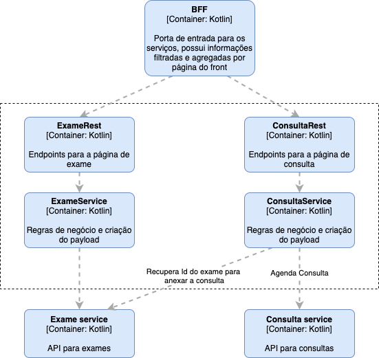

# Arquitetura

Arquitetura proposta para um ambiente de alto desempenho e escalável.

## Conceito geral

A arquitetura mostra uma alternativa para garantir uma aplicação tanto mobile quanto web leve, com baixo consumo de dados e rápida.

Esses pontos são importantes para que usuários em diversas faixas sociais e regiões do país consigam utilizar a ferramenta sem maiores impedimentos.

A solução permite escalabidade dos componentes de forma independente e o baixo acoplamente necessário para a evolução isolada e adequada de cada componente.

A arquitetura também é economicamente viável, permitindo a evolução parcial e contínua da solução.

As premissas visualizadas para a solução são:

- Baixo consumo de recursos dos usuários: Esse ponto é essêncial para que a solução seja utilizado pela maior parte das faixas sociais;
- Baixo acoplamento e independência dos componentes: Por ser um conceito novo e inovador, ao longo do caminho o negócio pode necessitar de modificações, sendo que essas devem ser feitas de forma menos traumática possível;
- Baixo custo de operação: Mantendo o custo da estrutura em dia é possível investir o dinheiro na evolução do negócio e sua aceitação pelo público, o que também contribui para a utilização da ferramenta pela maior parte das faixas sociais;

A arquitetura é composta dos seguintes elementos macro:

#### Front end

Aplicação SPA em React com design apropriado para a utilização dos usuários.

> Ponto de atenção:
> 
> O usuário tem a capacidade de fazer upload de imagens, essas imagens devem ser comprimidas no client side para economia de banda do usuário.

Haverá também um aplicativo mobile onde o usuário terá uma interação mais amigável com plataforma.

#### Backend For Frontend

O ponto de contato do front end é um API Gateway especializado para web e mobile, o padrão [Backend for Frontend](https://microservices.io/patterns/apigateway.html).

Esse serviço é responsável por agregar informações dos múltiplos serviços internos, para cada página e enviar a infromação consolidada e filtrada para a web ou mobile.

Suas principais funções são:
- Garantir o envio de toda a informação que o front precisa para a funcionalidade, garantindo o mínimo possível de dado trafegado entre o servidor e o cliente;
- Filtro e segurança das informações recebeidos e transmitidas para o cliente;
- Garantia de retrocompatibilidade com versões antigas dos clientes mobile;

#### Micro serviços

Diversos sistemas, cada um responsável por uma parte do trabalho do domínio.

A divisão proposta é por [subdomínio](https://microservices.io/patterns/decomposition/decompose-by-subdomain.html), por considerar mais clara em relação a responsabilidade e diminuir a chance de regras serem reimplementadads em partes diferentes do ambiente.

Caso o domínio ainda não seja tão claro, os microserviços podem ser separados por [capacidade de negócio, ou features](https://microservices.io/patterns/decomposition/decompose-by-business-capability.html). Assim teremos microserviços para funções específicas do negócio.

> Caso a divisão por negócio seja escolhida, é necessário ficar alerta para o acoplamento entre serviços e espalhamento de regras de negócio.
>
> Assim que possível, os serviços devem ser refatorados para apoiar o modelo de subdomínio.

Cada serviço pode possuir uma base de dados própria para trabalhar os dados de forma mais eficiente. Essa base tem a obrigação de represar demandas que seriam feitas à base principal, de entregar para os serviços um dado já preparado para consumo rápido e de ter uma busca rápida e otimizada para ações mais feitas.

Recomendo o uso de bases NoSQL, cabendo ao time escolher qual a melhor categoria para o problema.

Os serviços podem ser comunicar entre si, mas essa comunicação deve se reservar a casos especiais. Um serviço que depende muito de outro deve ser revisto e refatorado, podendo esse efeito ser sintoma de falha na quebra de subdomínio.

#### Database 

A base de dados principal terá os dados de todo o domínio, de forma relacional permitindo a criação de relatórios e análises de inteligência.

Os dados dentro dessa base devem ser protegido de acessos não autorizados e possuir replicação, backup e rastreabilidade.

Para garantir a segurança dessa base, uma API será criada em cima do banco para isolar características da tecnologia utilizada ou do design das tabelas com a visão do domínio. Essa API garante o controle de acesso ao banco e permite a evolução do modelo de uma forma mais transparente.

#### Infraestrutura

##### Armazenamento de imagens

As imagens devem ser armazenadas em um storage de alta capacidade, de forma criptografada e identificada com o usuário (por um hash, por exemplo) permitindo o rastreio dos dados.

Esses dados devem possuir backup em diversas regiões, junto com os dados do banco principal para garantir a continuidade do negócio e segurança jurídica dos clientes.

##### Mensageria

É possível que os microserviços se comuniquem com o banco principal por mensageria. Isso garante uma absorvição de operações repentinas, não causando assim gargalo no banco, apenas aumentando a latência das operações.

##### Rede pública e privada

Os sistemas são dividos de forma que toda a regra de negócio e dados fiquem isolados de acessos externos, garantindo uma segurança a mais na plataforma.

Os BFFs são os únicos a tocar a parte pública da rede, porém eles tem esse contato apenas através de seus balanceadores de carga, a aplicação mesmo fica dentro da rede privada.

##### CDN

A CDN tem um papel fundamental na arquitetura, garantindo que qualquer dado que saia do servidor chegue comprimido no cliente, garantindo a premissa de consumo de banda. Além disso ela garante o cache e firewall do ambiente, aumentando mais um pouco a segurança da plataforma como um todo.

## Casos de uso

Aqui detalharei um caso de uso da plataforma:

A marcação de consulta para mostrar o resultado de exames.

Nesse cenário, o usuário entra na aplicação web e faz o upload de uma imagem dos exames, após o upload ele requisita a marcação de consulta, podendo escolher horários livres.

> Obs: Estou utilizando o [modelo C4](https://c4model.com/) de visualização para maior clareza do cenário

Nesse cenário os seguintes passos são executados:
- o site faz uma requisição para o BFF com o arquivo do exame;
- o BFF chama o serviço de exame para fazer a inserção;
- o serviço, salva o registro em sua base, guarda o arquivo no storage e registra na DB API o exame;
- a DB API faz as N operações no banco de dados para inserir o exame do usuário;
- após a inserção o BFF chama o serviço de Consulta para verifcar os horários livres;
- o BFF envia para a aplicação Web as possibilidades de agenda;
- o usuário escolhe a data e a aplicação Web envia essa informação para o BFF;
- o BFF envia a data para o serviço de Consulta que registra a data selecionada na base;
- o serivço de Consulta registra a utilização no DB API;
- o DB API faz as operações necessárias na base principal;
- o serviço de consulta e o BFF retornam a confirmação de agendamento para o aplicativo Web que por sua vez avisa o usuário.

> Obs.: Na AWS eu utilizaria a capacidade do S3 de criar urls assinadas para uploads de arquivo para fazer o cliente subir a imagem diretamente para o bucket. Assim esse dado sensível não precisa trafegar por dentro dos sistemas garantindo segurança ao dado além de diminuir o custo interno com rede

A aplicação web possui um componte React para a marcação de consulta e outro para o envio de exames.

O componente de exames utiliza uma biblioteca de compressão de imagem para diminuir o tamanho do arquivo antes do upload.

Ex.: https://www.npmjs.com/package/browser-image-compression

O componente de consulta exibe um calendário com as data disponíveis para o usuário poder escolher a melhor opção.

Ambos os componentes utilizam o API Component que encapsula as regras para chamada a API.

O BFF possui um endpoint para cada ação dentro da página Web que possui as regras de negócio para compor os dados necessários e criar o payload para o cliente receber tudo o que for possível em um único request.

Os serviços acabam tendo uma estrutura similar, um [chassi em comum](https://microservices.io/patterns/microservice-chassis.html), essa padronização ajuda os times a criar novos serviços a partir de um bootstrap conhecido e permite que o serviço troque de time com menos atrito.

Ambos possuem endpoints Rest para as ações, uma classe de negócio onde ficam as regras daquele subdomínio. Essas são as principais classes de todo o negócio.

Essas classes são apoiadas pelos repositórios que encapsulam os acessos a entidades externas.

A API do DB possui uma camada de regras de negócio e uma camada de serviço que são agrupamento lógicos de ações em um subdomínio específico, por exemplo, a marcação de consulta requer a inserção do registro e a diminuição da cota de consultas do usuário naquele mês.

Novamente há uma camada de repositório para encapsular a complexidade de acesso ao banco.

## Estrutura de tabelas

As tabelas devem ser baseadas nos subdomínios. 

No exemplo acima é possível notar 3 subdomínios: _Exames_, _Consultas_ e _Paciente_.

Não possuo informação suficiente para criar o MER com os dados e as informações parciais não achei agregar valor.

Em todo o caso o modelo deve ser criado baseado nas premissas de negócio e com a participação do time de inteligência/dados e desenvolvimento.

## Evolução e considerações finais

Essa arquitetura não contempla algumas features importantes para a evolução e manutenção do negócio, entre elas é possível citar:

- Rastreabilidade por logs das ações dos usuários;
- Anonimização dos dados para a LGPD;
- Estrutura para concorrência de agendamento de consultas, para evitar overbooking;
- Estrutura para garantir a persistência de operações complexas ou rollback em cascata (SAGA Pattern);
- Mensageria para atualização das bases de dados dos serviços em caso de mudança na base principal